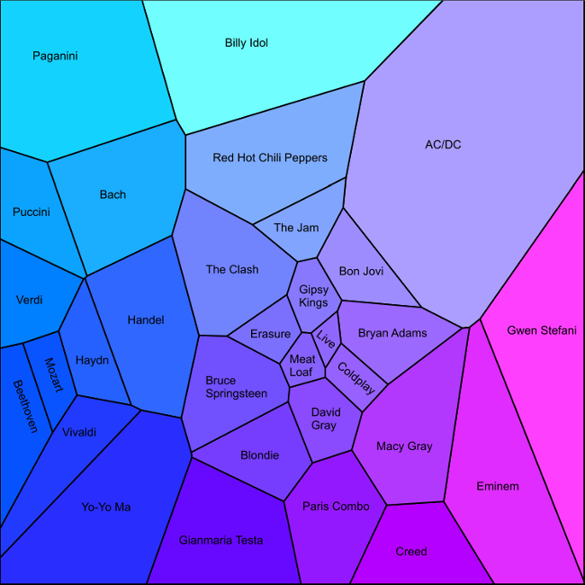

Title: Visualizing the Similarity of Musical Artists
Date: 2015-12-25
Slug: artistmap

# Visualizing the Similarity of Musical Artists

A while back I created a [visual map](/musicmap/) of my music collection by
calculating the statistical similarity between the audio waveforms of each
track. The algorithm worked quite well but I wasn't fully satisfied with the
visualization approach; the graphic was too crowded and made it hard to see the
overall similarity between genres of music.

Recently I developed a new and simpler approach that I think gives
a more intuitive visualization. Instead of mapping out each song
individually, the new approach aggregates all songs from the same
artist and then creates a 2D map in which artists from similar genres
appear close to each other (e.g. Mozart is next to Beethoven, but far
from Eminem). It is fun to look over the map and visually explore
which artists the algorithm believes sound most similar to each
other.

I've often thought music services like Pandora or iTunes could use
this idea of a 2D music map to create an awesome user-interface for
their music recommendation systems. With all the extra metadata they
have about songs they could create very accurate maps. Maybe I'll get
in touch with them to suggest it!

The algorithm to create the map is very simple, and the
visualization is also straightforward thanks to the
excellent [deldir](http://cran.r-project.org/web/packages/deldir/index.html)
package in R which computes Voronoi tesselations. The only manual step
is the labeling of the artists which I did
using [Xara](http://www.xara.com) Photo and Graphic
Designer (a great piece of software and good value too). Here are the
basic steps:

1. Put together a training set of MP3 files with several example
   songs from each artist.
2. Extract statistical features from the waveform of each MP3
   file. For this example I extracted 42 different features.
3. Create a 2D approximation of the 42-dimensional feature space by
   using the first two principal components of the feature matrix.
4. Average all the 2D points corresponding to songs from the same
   artist to create a single XY point for each artist.
5. Draw a Voronoi diagram using the artists' XY points to define
   regions of the XY plane corresponding to each artist.
6. Add some text for the artist labels.


And here is the final product. Read on to see exactly how it was
created.



The first step is to extract statistical features from the waveform
of each MP3 file. I covered this step in depth in my earlier article
[Mapping Your Music Collection](/musicmap/) so please
refer to that page for all the details.

Next we use R to do the dimension reduction, aggregate the
resulting points by artist, and plot the Voronoi diagram. Here's the R
code; you can also download the
file [songdata.csv](static/artistmap/songdata.csv) which contains artist,
album, track name, and 42 statistical features for 753 songs by 31
artists.

```R
fs <- read.csv("songdata.csv")

# Extract feature matrix (i.e. remove the first three columns)
f <- fs[, -(1:3)]

# Compute the principal components of the feature matrix
# Note that p$scores contains the actual loadings
p <- princomp(as.matrix(f), cor = TRUE)

# Average the first two principal components of all the songs for each
# artist into a single XY point
d <- aggregate(p$scores[, 1:2], by = list(artist = fs$artist), mean)
names(d) <- c("artist", "x", "y")

# Define the color of the region for each artist.
# First scale the X and Y coordinates of the artists to lie in [0, 1]
scale01 <- function(x) (x - min(x)) / (max(x) - min(x))
xs <- scale01(d$x)
ys <- scale01(d$y)
# Then use these as the Red and Green components, with Blue fixed at 1
artist_color <- rgb(xs, ys, 1)

# Set up a new graphics window with no borders
dev.new(width = 10, height = 10)
par(mai = c(0, 0, 0, 0))

# Draw an empty plot
plot(d$x, d$y, type = "n")

# Load the deldir package to perform Voronoi tesselations
library(deldir)

# Compute and plot the Voronoi region for each artist
regions <- tile.list(deldir(d))
for(k in 1:length(regions)) {
  polygon(regions[[k]], col = artist_color[k], lwd = 2)
}
```

The last step is to add the artist labels. You can do this
programmatically in R but they won't align nicely with the edges of
the regions so instead I added them manually using Xara Photo and
Graphic Designer.

The final bitmap is shown above, but since everything in this
visualization is made up of lines and polygons it also produces a nice
resolution-independent PDF file (available [here](static/artistmap/artistmap.pdf)).
