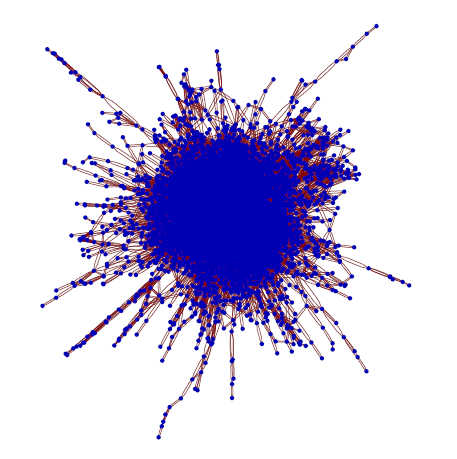

[&larr; Back to main page](/)

Doublets are a type of word puzzle invented by Lewis Carroll (author of
"Alice in Wonderland"). The goal is to change one word into another by
adding, removing, or changing one letter at a time. The tricky part is
that each intermediate step must also be a valid word. For more
information see <http://thinks.com/puzzles/doublets.htm>.

If we think of words as vertices in a graph, then two words are
connected by an edge if the
[edit distance](http://en.wikipedia.org/wiki/Levenshtein_distance)
between them is exactly 1. Mathematica can then be used to solve
a doublet with its shortest-path algorithm GraphPath.


To see a real-time implementation of this you can take a look at my
[Mathematica Doublets Demonstration](http://demonstrations.wolfram.com/Doublets/).
This article goes into a bit more depth on how the demonstration was
created. All the code is written for Mathematica 6.0.

First, let's get a list of all lowercase 5-letter words.

```mathematica
d = DictionaryLookup[RegularExpression["[a-z]{1,5}"]];
```

It's pretty big!

```mathematica
Length[d]
8508
```

We'll just take the first 1000 words for purposes of this example.

```mathematica
d = Take[d, 1000];
```

Now we want to build up a graph **g** that shows which words are
"connected" to each other i.e. have EditDistance == 1. This code is
computationally intensive and takes about 20 minutes to run. Notice I
have added a quick check at the beginning to skip out if the words
differ in length by more than 1, since there is no way these two words
could be connected in that case. I would welcome any way to optimize
this code!

```mathematica
g = {};
Do[
 Do[
  If[Abs[StringLength[d[[i]]] - StringLength[d[[j]]]] > 1, Continue[]];
  If[EditDistance[d[[i]], d[[j]]] == 1, AppendTo[g, d[[i]] -> d[[j]]];
    AppendTo[g, d[[j]] -> d[[i]]]],
  {j, i + 1, Length[d]}],
 {i, 1, Length[d]}]
```

Let's plot the graph to see which words are connected.

```mathematica
GraphPlot[g]
```


There are quite a few little groups of words which are only connected to
each other. We want to get rid of those and just keep the big cluster.
The next step uses StrongComponents to automatically identify the
biggest cluster and keep only that subset of the graph.

```mathematica
Needs["GraphUtilities`"]

s = StrongComponents[g];
```

We'll sort the connected components by number of member words, and take
the largest component (i.e. the big cluster in the picture above).

```mathematica
sc = Last[SortBy[s, Length]];
```

Filter graph **g** to only include words which appear
in **gc**, the biggest cluster.

```mathematica
gc = Select[g, MemberQ[sc, #[[1]]] &];
```

Confirm that we have correctly filtered and are left with a big group of
words where you can go from any word to any other by just changing one
letter (i.e. EditDistance == 1).

```mathematica
GraphPlot[gc]
```



Let's test that we can solve a doublet using the shortest-path algorithm
built into Mathematica. We'll find the shortest distance between the
vertices "sleep" and "dream" in the graph **gc**.

```mathematica
GraphPath[gc, "sleep", "dream"]

{"sleep", "seep", "seem", "seam", "ream", "dream"}
```
