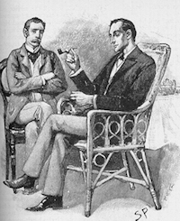

[&larr; Back to main page](/)


Sir Arthur Conan Doyle's Sherlock Holmes stories represent some of the finest
detective literature ever written. In total Doyle wrote four Holmes novels and
56 short stories, a body of work enthusiasts affectionately refer to as "The
Canon". As might be expected with such a large corpus of text written over a
period of forty years, there is a significant variation in quality between the
Holmes stories. In general, Doyle's earlier collections of stories ("The
Adventures of Sherlock Holmes", "The Memoirs of Sherlock Holmes", "The Return of
Sherlock Holmes") are considered superior to his later ones ("The Casebook of
Sherlock Holmes", "His Last Bow").

What makes a good Sherlock Holmes story? The quality of a piece of literature is
difficult to measure objectively, and depends as much on personal preference as
it does on writing style, plot development, characters, pacing and so on.
Randall Stock's article
["Rating Sherlock Holmes"](http://www.bestofsherlock.com/story/storyhm.htm)
(The Baker Street Journal, December 1999, pp. 5-11) polled Sherlockian experts
from around the world to come up with a comprehensive ranking of all 56
short stories.

I thought it would be interesting to explore how the quality of a story relates
to statistical properties of the text itself. Does lots of dialog generally make
for a good story? What about the length of the story, or the average number of
words per sentence? Since the text of these works is now in the public domain
(with some restrictions depending on the country you are in) it is possible to
text mine the data, extract statistics from the text, and build a regression
that relates them to the overall quality of the story.

For simplicity, I turned the ranking of the 56 stories into ratings on a five
point scale: one star being worst, five stars being best.

<table>
  <tr>
    <th>Rating</th>
    <th>Stories</th>
  </tr>
  <tr>
    <td>&#9733;&#9733;&#9733;&#9733;&#9733;</td>
    <td style="padding: 10px;">
    A Scandal In Bohemia,
    The Red-Headed League,
    The Adventure Of The Blue Carbuncle,
    The Adventure Of The Speckled Band,
    Silver Blaze,
    The Musgrave Ritual,
    The Final Problem,
    The Adventure Of The Empty House,
    The Adventure Of The Dancing Men,
    The Adventure Of The Six Napoleons,
    The Adventure Of The Bruce-Partington Plans
    </td>
  </tr>
  <tr>
    <td>&#9733;&#9733;&#9733;&#9733;</td>
    <td style="padding: 10px;">
    The Man With The Twisted Lip,
    The Adventure Of The Copper Beeches,
    The Naval Treaty,
    The Adventure Of The Solitary Cyclist,
    The Adventure Of The Priory School,
    The Adventure Of Charles Augustus Milverton
    The Adventure Of The Abbey Grange,
    The Adventure Of The Second Stain,
    The Adventure Of The Devil's Foot,
    His Last Bow,
    The Problem Of Thor Bridge
    </td>
  </tr>
  <tr>
    <td>&#9733;&#9733;&#9733;</td>
    <td style="padding: 10px;">
    The Boscombe Valley Mystery,
    The Five Orange Pips,
    The Adventure Of The Engineer's Thumb,
    The "Gloria Scott",
    The Crooked Man,
    The Greek Interpreter,
    The Adventure Of The Norwood Builder,
    The Adventure Of Black Peter,
    The Adventure Of The Cardboard Box,
    The Adventure Of The Dying Detective,
    The Illustrious Client,
    The Adventure Of The Lion's Mane
    </td>
  </tr>
  <tr>
    <td>&#9733;&#9733;</td>
    <td style="padding: 10px;">
    A Case Of Identity,
    The Adventure Of The Noble Bachelor,
    The Yellow Face,
    The Reigate Puzzle,
    The Resident Patient,
    The Adventure Of Wisteria Lodge,
    The Adventure Of The Red Circle,
    The Disappearance Of Lady Frances Carfax,
    The Adventure Of The Three Garridebs,
    The Adventure Of The Creeping Man,
    The Adventure Of Shoscombe Old Place
    </td>
  </tr>
  <tr>
    <td>&#9733;</td>
    <td style="padding: 10px;">
    The Adventure Of The Beryl Coronet,
    The Stock-Broker's Clerk,
    The Adventure Of The Three Students,
    The Adventure Of The Golden Pince-Nez,
    The Adventure Of The Missing Three-Quarter,
    The Blanched Soldier,
    The Adventure Of The Mazarin Stone,
    The Adventure Of The Three Gables,
    The Adventure Of The Sussex Vampire,
    The Adventure Of The Veiled Lodger,
    The Adventure Of The Retired Colourman
    </td>
  </tr>
</table>

## Data Overview

In this article I'll skip over the data preparation and just cover the
regression modeling and its conclusions. The file
[HolmesFeatures.csv](HolmesFeatures.csv) contains 60
observations, one for each of the 56 short stories and one for each of the four
novels. Descriptions for the columns are as follows:

title
: Title of the story/novel

abbrev
: The standard 4 character abbreviation for the story/novel (ENGR, 3STU, etc.).

rank
: The ranking of the story/novel from the 1999 poll. For the stories this ranges from 1 (best) to 56 (worst) and for the novels it ranges from 1 (best) to 4 (worst).

pubdate
: Year and month of publication (1890-Feb, 1891-Jul, etc.).

collection
: The collection in which the story was published. This is either adventures,
  memoirs, return, bow, casebook or (in the case of the novels), novel.

avg_chars_per_word
: The average number of characters per word.

avg_words_per_sentence
: The average number of words per sentence.

num_words
: The total number of words.

pct_dialog_words_with_exclamation
: The percentage of dialog words that end with "!".

pct_words_dialog
: The percentage of words which are dialog.

pct_words_holmes
: The percentage of words that are "Holmes".

pct_words_type_name
: The percentage of words that are names (either first names or last names, and either male or female).

pct_words_type_noun
: The percentage of words that are nouns.

pct_words_type_other
: The percentage of words that are not one of the other types.

pct_words_type_stopword
: The percentage of words that are stopwords (and, the, is, etc.).

pct_words_type_verb
: The percentage of words that are verbs.

pct_words_watson
: The percentage of words that are "Watson".

## Fitting a Regression Model

The first step is to get the data into R:

```R
# Clean up the workspace
graphics.off()
rm(list=ls())

# Read in data
f <- read.csv("HolmesFeatures.csv")

# Select only short stories (i.e. exclude novels)
d <- subset(f, collection != "novel")

# Convert rank (1=best to 56=worst) into quality (1=worst to 5=best)
d$quality <- as.numeric(cut(-d$rank, 5, labels=FALSE))
```

Now we need to decide which variables to include in the regression. We have 12
variables that capture the statistical properties of the text and we would like
to use these to predict the quality of the story on a scale of 1 to 5. However,
we only have 56 observations (i.e. stories), so forcing all 12 variables into
the model would almost certainly result in unreliable parameter estimates for
some variables. Instead we will use cross-validation to pick the optimal number
of variables that avoid overfitting our data. We use R's stepwise variable
selection to create models of increasing complexity, and then check the cross-
validated mean-squared error of each of these models.

```R
# Define formula with all eligible variables for the regression
fml.full <- formula(quality ~
  avg_chars_per_word +
  avg_words_per_sentence +
    num_words +
  pct_dialog_words_with_exclamation +
  pct_words_dialog +
  pct_words_holmes +
  pct_words_type_name +
  pct_words_type_noun +
  pct_words_type_other +
  pct_words_type_stopword +
  pct_words_type_verb +
  pct_words_watson)

# Create cross-validation folds
cv.ind <- sample(rep(1:10, length.out = nrow(d)))

# Create models of increasing complexity, compute cross-validation error
max.vars <- 0:8
mse <- rep(NA, length(max.vars))
for (i in 1:length(max.vars)) {
  pred <- rep(NA, nrow(d))
  for (k in 1:10) {
    train <- cv.ind != k
    test <- !train
    m.null <- lm(quality ~ 1, d, subset = train)
    m.sel <- step(m.null, fml.full, steps = max.vars[i], k = 0)
    pred[test] <- predict(m.sel, d)[test]
  }
  mse[i] <- mean((pred - d$quality)^2)
}

# Examine error vs. number of variables in model
plot(max.vars, mse, type = "b", xlab = "Number of variables in model",
  ylab = "Cross-Validation Error", xaxp = c(0, 8, 8))
points(max.vars[which.min(mse)], min(mse), pch = 16, col = "red")
```


Great, it looks like a model with three variables gives us the best performance.
Let's refit a three-variable model on all the data and take a look at the
results.

```R
# Fit model
m.null <- lm(quality ~ 1, d)
m.sel <- step(m.null, fml.full, steps = 3, k = 0)

# Examine results
summary(m.sel)
```

```text
Coefficients:
                         Estimate Std. Error t value Pr(>|t|)
(Intercept)             1.412e-01  1.486e+00   0.095 0.924651
num_words               3.408e-04  9.359e-05   3.642 0.000625 ***
pct_words_dialog       -4.873e-02  1.519e-02  -3.208 0.002287 **
avg_words_per_sentence  2.361e-01  7.776e-02   3.037 0.003733 **

Signif. codes:  0 '***' 0.001 '**' 0.01 '*' 0.05 '.' 0.1 ' ' 1
```

OK, we have a model that suggests there are some strong relationships between
the statistical properties of the text and the quality of a Sherlock Holmes
story! So how do we interpret these results? The magnitude and sign of the
coefficient estimates tell us the effect of each variable on the quality of the
story. Here's what we conclude:

- **Longer stories are better.** The quality of a story increases by 1 star for
  every 2,934 words in a story.
- **Lots of dialog is a bad thing.** The quality of a story decreases by 1 star
  for each 20 percentage point increase in the amount of dialog.
- **Longer sentences are better.** The quality of a story increases by 1 star
  as the average sentence length increases by 4 words.

## Model Performance

Although this is a very simple model with only three variables it does
surprisingly well at predicting the quality of a story. The table below shows
the actual quality of each story (as determined by a poll of experts) versus the
quality predicted by the model. In many cases the model precisely agrees with
the experts (indicated by a set of green stars). Even in the cases where the
model is wrong (shown in red), it is usually only off by one star.

<table class="table">
<tr>
<th>Story</th>
<th>Actual Quality</th>
<th>Predicted Quality</th>
</tr>
<tr>
<td>A Scandal In Bohemia</td>
<td>&#9733;&#9733;&#9733;&#9733;&#9733;</td>
<td><span style="color:#aa0000">&#9733;&#9733;&#9733;</span></td>
</tr>
<tr>
<td>The Red-headed League</td>
<td>&#9733;&#9733;&#9733;&#9733;&#9733;</td>
<td><span style="color:#aa0000">&#9733;&#9733;&#9733;&#9733;</span></td>
</tr>
<tr>
<td>A Case Of Identity</td>
<td>&#9733;&#9733;</td>
<td><span style="color:#aa0000">&#9733;&#9733;&#9733;</span></td>
</tr>
<tr>
<td>The Boscombe Valley Mystery</td>
<td>&#9733;&#9733;&#9733;</td>
<td><span style="color:#00aa00">&#9733;&#9733;&#9733;</span></td>
</tr>
<tr>
<td>The Five Orange Pips</td>
<td>&#9733;&#9733;&#9733;</td>
<td><span style="color:#aa0000">&#9733;&#9733;</span></td>
</tr>
<tr>
<td>The Man With The Twisted Lip</td>
<td>&#9733;&#9733;&#9733;&#9733;</td>
<td><span style="color:#00aa00">&#9733;&#9733;&#9733;&#9733;</span></td>
</tr>
<tr>
<td>The Adventure Of The Blue Carbuncle</td>
<td>&#9733;&#9733;&#9733;&#9733;&#9733;</td>
<td><span style="color:#aa0000">&#9733;&#9733;&#9733;</span></td>
</tr>
<tr>
<td>The Adventure Of The Speckled Band</td>
<td>&#9733;&#9733;&#9733;&#9733;&#9733;</td>
<td><span style="color:#aa0000">&#9733;&#9733;&#9733;&#9733;</span></td>
</tr>
<tr>
<td>The Adventure Of The Engineer's Thumb</td>
<td>&#9733;&#9733;&#9733;</td>
<td><span style="color:#00aa00">&#9733;&#9733;&#9733;</span></td>
</tr>
<tr>
<td>The Adventure Of The Noble Bachelor</td>
<td>&#9733;&#9733;</td>
<td><span style="color:#aa0000">&#9733;&#9733;&#9733;</span></td>
</tr>
<tr>
<td>The Adventure Of The Beryl Coronet</td>
<td>&#9733;</td>
<td><span style="color:#aa0000">&#9733;&#9733;&#9733;</span></td>
</tr>
<tr>
<td>The Adventure Of The Copper Beeches</td>
<td>&#9733;&#9733;&#9733;&#9733;</td>
<td><span style="color:#aa0000">&#9733;&#9733;&#9733;</span></td>
</tr>
<tr>
<td>Silver Blaze</td>
<td>&#9733;&#9733;&#9733;&#9733;&#9733;</td>
<td><span style="color:#aa0000">&#9733;&#9733;&#9733;</span></td>
</tr>
<tr>
<td>The Yellow Face</td>
<td>&#9733;&#9733;</td>
<td><span style="color:#aa0000">&#9733;&#9733;&#9733;</span></td>
</tr>
<tr>
<td>The Stock-broker's Clerk</td>
<td>&#9733;</td>
<td><span style="color:#aa0000">&#9733;&#9733;</span></td>
</tr>
<tr>
<td>The "gloria Scott"</td>
<td>&#9733;&#9733;&#9733;</td>
<td><span style="color:#00aa00">&#9733;&#9733;&#9733;</span></td>
</tr>
<tr>
<td>The Musgrave Ritual</td>
<td>&#9733;&#9733;&#9733;&#9733;&#9733;</td>
<td><span style="color:#aa0000">&#9733;&#9733;&#9733;</span></td>
</tr>
<tr>
<td>The Reigate Puzzle</td>
<td>&#9733;&#9733;</td>
<td><span style="color:#aa0000">&#9733;&#9733;&#9733;</span></td>
</tr>
<tr>
<td>The Crooked Man</td>
<td>&#9733;&#9733;&#9733;</td>
<td><span style="color:#00aa00">&#9733;&#9733;&#9733;</span></td>
</tr>
<tr>
<td>The Resident Patient</td>
<td>&#9733;&#9733;</td>
<td><span style="color:#aa0000">&#9733;&#9733;&#9733;</span></td>
</tr>
<tr>
<td>The Greek Interpreter</td>
<td>&#9733;&#9733;&#9733;</td>
<td><span style="color:#00aa00">&#9733;&#9733;&#9733;</span></td>
</tr>
<tr>
<td>The Naval Treaty</td>
<td>&#9733;&#9733;&#9733;&#9733;</td>
<td><span style="color:#00aa00">&#9733;&#9733;&#9733;&#9733;</span></td>
</tr>
<tr>
<td>The Final Problem</td>
<td>&#9733;&#9733;&#9733;&#9733;&#9733;</td>
<td><span style="color:#aa0000">&#9733;&#9733;&#9733;&#9733;</span></td>
</tr>
<tr>
<td>The Adventure Of The Empty House</td>
<td>&#9733;&#9733;&#9733;&#9733;&#9733;</td>
<td><span style="color:#00aa00">&#9733;&#9733;&#9733;&#9733;&#9733;</span></td>
</tr>
<tr>
<td>The Adventure Of The Norwood Builder</td>
<td>&#9733;&#9733;&#9733;</td>
<td><span style="color:#00aa00">&#9733;&#9733;&#9733;</span></td>
</tr>
<tr>
<td>The Adventure Of The Dancing Men</td>
<td>&#9733;&#9733;&#9733;&#9733;&#9733;</td>
<td><span style="color:#aa0000">&#9733;&#9733;&#9733;&#9733;</span></td>
</tr>
<tr>
<td>The Adventure Of The Solitary Cyclist</td>
<td>&#9733;&#9733;&#9733;&#9733;</td>
<td><span style="color:#00aa00">&#9733;&#9733;&#9733;&#9733;</span></td>
</tr>
<tr>
<td>The Adventure Of The Priory School</td>
<td>&#9733;&#9733;&#9733;&#9733;</td>
<td><span style="color:#00aa00">&#9733;&#9733;&#9733;&#9733;</span></td>
</tr>
<tr>
<td>The Adventure Of Black Peter</td>
<td>&#9733;&#9733;&#9733;</td>
<td><span style="color:#00aa00">&#9733;&#9733;&#9733;</span></td>
</tr>
<tr>
<td>The Adventure Of Charles Augustus Milverton</td>
<td>&#9733;&#9733;&#9733;&#9733;</td>
<td><span style="color:#00aa00">&#9733;&#9733;&#9733;&#9733;</span></td>
</tr>
<tr>
<td>The Adventure Of The Six Napoleons</td>
<td>&#9733;&#9733;&#9733;&#9733;&#9733;</td>
<td><span style="color:#aa0000">&#9733;&#9733;&#9733;&#9733;</span></td>
</tr>
<tr>
<td>The Adventure Of The Three Students</td>
<td>&#9733;</td>
<td><span style="color:#00aa00">&#9733;</span></td>
</tr>
<tr>
<td>The Adventure Of The Golden Pince-nez</td>
<td>&#9733;</td>
<td><span style="color:#aa0000">&#9733;&#9733;&#9733;</span></td>
</tr>
<tr>
<td>The Adventure Of The Missing Three-quarter</td>
<td>&#9733;</td>
<td><span style="color:#aa0000">&#9733;&#9733;&#9733;</span></td>
</tr>
<tr>
<td>The Adventure Of The Abbey Grange</td>
<td>&#9733;&#9733;&#9733;&#9733;</td>
<td><span style="color:#aa0000">&#9733;&#9733;&#9733;</span></td>
</tr>
<tr>
<td>The Adventure Of The Second Stain</td>
<td>&#9733;&#9733;&#9733;&#9733;</td>
<td><span style="color:#aa0000">&#9733;&#9733;&#9733;</span></td>
</tr>
<tr>
<td>The Adventure Of Wisteria Lodge</td>
<td>&#9733;&#9733;</td>
<td><span style="color:#aa0000">&#9733;&#9733;&#9733;&#9733;</span></td>
</tr>
<tr>
<td>The Adventure Of The Cardboard Box</td>
<td>&#9733;&#9733;&#9733;</td>
<td><span style="color:#00aa00">&#9733;&#9733;&#9733;</span></td>
</tr>
<tr>
<td>The Adventure Of The Red Circle</td>
<td>&#9733;&#9733;</td>
<td><span style="color:#00aa00">&#9733;&#9733;</span></td>
</tr>
<tr>
<td>The Adventure Of The Bruce-partington Plans</td>
<td>&#9733;&#9733;&#9733;&#9733;&#9733;</td>
<td><span style="color:#aa0000">&#9733;&#9733;&#9733;</span></td>
</tr>
<tr>
<td>The Adventure Of The Dying Detective</td>
<td>&#9733;&#9733;&#9733;</td>
<td><span style="color:#aa0000">&#9733;&#9733;</span></td>
</tr>
<tr>
<td>The Disappearance Of Lady Frances Carfax</td>
<td>&#9733;&#9733;</td>
<td><span style="color:#aa0000">&#9733;&#9733;&#9733;</span></td>
</tr>
<tr>
<td>The Adventure Of The Devil's Foot</td>
<td>&#9733;&#9733;&#9733;&#9733;</td>
<td><span style="color:#aa0000">&#9733;&#9733;&#9733;&#9733;&#9733;</span></td>
</tr>
<tr>
<td>His Last Bow</td>
<td>&#9733;&#9733;&#9733;&#9733;</td>
<td><span style="color:#aa0000">&#9733;&#9733;</span></td>
</tr>
<tr>
<td>The Illustrious Client</td>
<td>&#9733;&#9733;&#9733;</td>
<td><span style="color:#aa0000">&#9733;&#9733;&#9733;&#9733;</span></td>
</tr>
<tr>
<td>The Blanched Soldier</td>
<td>&#9733;</td>
<td><span style="color:#aa0000">&#9733;&#9733;</span></td>
</tr>
<tr>
<td>The Adventure Of The Mazarin Stone</td>
<td>&#9733;</td>
<td><span style="color:#00aa00">&#9733;</span></td>
</tr>
<tr>
<td>The Adventure Of The Three Gables</td>
<td>&#9733;</td>
<td><span style="color:#00aa00">&#9733;</span></td>
</tr>
<tr>
<td>The Adventure Of The Sussex Vampire</td>
<td>&#9733;</td>
<td><span style="color:#aa0000">&#9733;&#9733;</span></td>
</tr>
<tr>
<td>The Adventure Of The Three Garridebs</td>
<td>&#9733;&#9733;</td>
<td><span style="color:#00aa00">&#9733;&#9733;</span></td>
</tr>
<tr>
<td>The Problem Of Thor Bridge</td>
<td>&#9733;&#9733;&#9733;&#9733;</td>
<td><span style="color:#aa0000">&#9733;&#9733;&#9733;</span></td>
</tr>
<tr>
<td>The Adventure Of The Creeping Man</td>
<td>&#9733;&#9733;</td>
<td><span style="color:#aa0000">&#9733;&#9733;&#9733;</span></td>
</tr>
<tr>
<td>The Adventure Of The Lion's Mane</td>
<td>&#9733;&#9733;&#9733;</td>
<td><span style="color:#aa0000">&#9733;&#9733;&#9733;&#9733;</span></td>
</tr>
<tr>
<td>The Adventure Of The Veiled Lodger</td>
<td>&#9733;</td>
<td><span style="color:#00aa00">&#9733;</span></td>
</tr>
<tr>
<td>The Adventure Of Shoscombe Old Place</td>
<td>&#9733;&#9733;</td>
<td><span style="color:#00aa00">&#9733;&#9733;</span></td>
</tr>
<tr>
<td>The Adventure Of The Retired Colourman</td>
<td>&#9733;</td>
<td><span style="color:#00aa00">&#9733;</span></td>
</tr>

</table>
