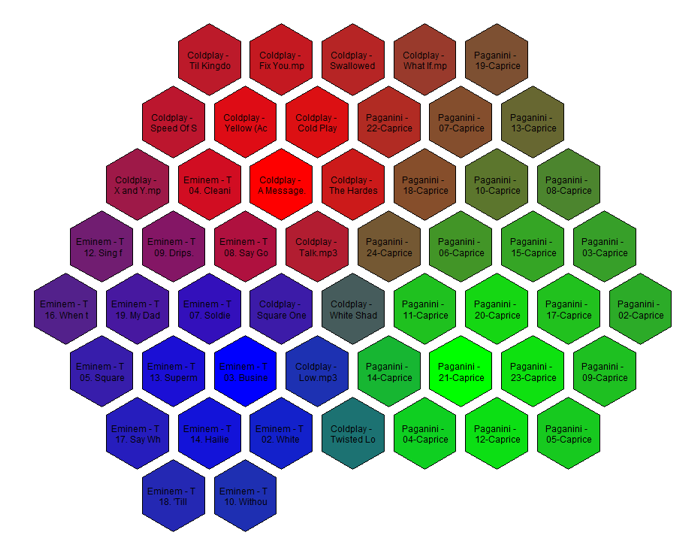
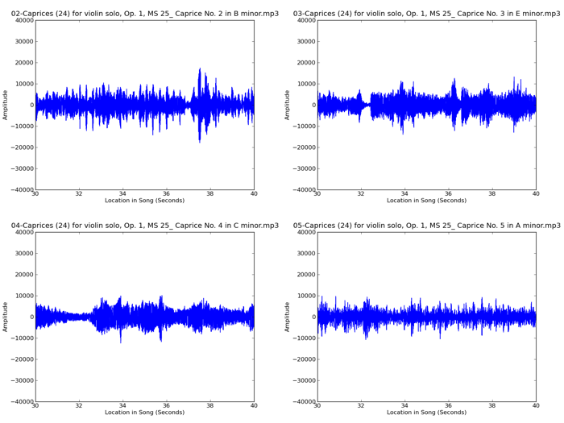
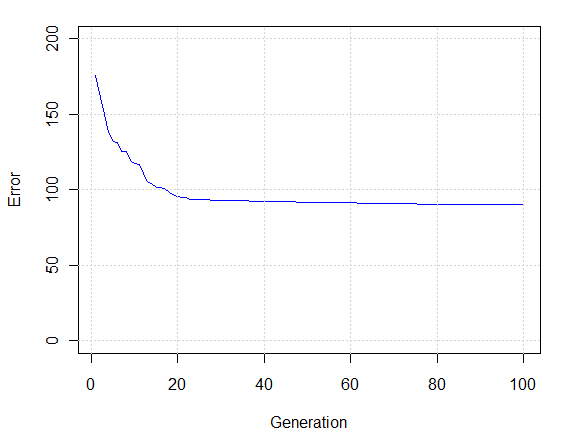
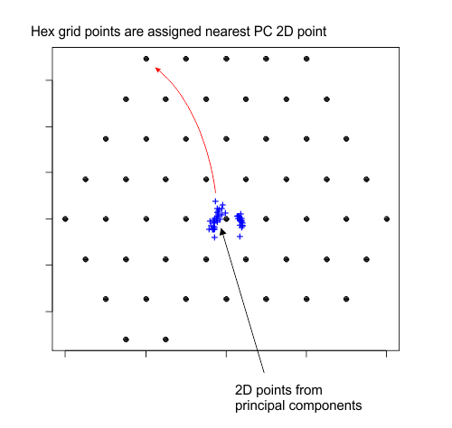
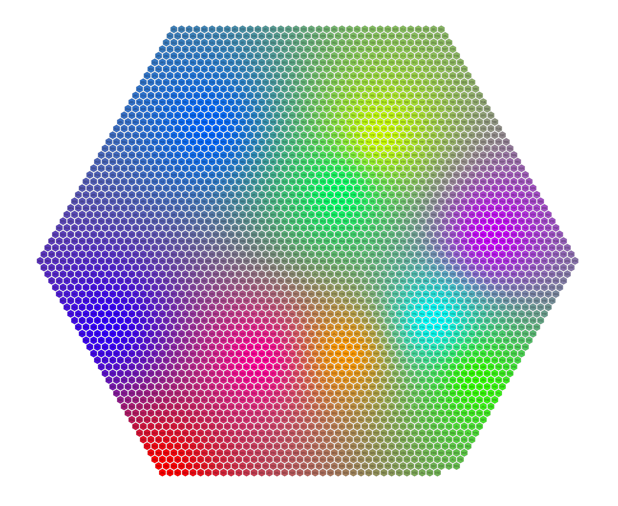

[&larr; Back to main page](/)

In this article we'll explore a neat way of visualizing your MP3 music
collection. The end result will be a hexagonal map of all your songs, with
similar sounding tracks located next to each other. The color of different
regions corresponds to different genres of music (e.g. classical, hip hop, hard
rock). As an example, here's a map of three albums from my music collection:
Paganini's Violin Caprices, Eminem's The Eminem Show, and Coldplay's X&Y.



To make things more interesting (and in some cases simpler), I imposed some
constraints. First, the solution should not rely on any pre-existing ID3 tags
(e.g. Arist, Genre) in the MP3 files-only the statistical properties of the
sound should be used to calculate the similarity of songs. A lot of my MP3 files
are poorly tagged anyways, and I wanted to keep the solution applicable to any
music collection no matter how bad its metadata. Second, no other external
information should be used to create the visualization-the only required inputs
are the user's set of MP3 files. It is possible to improve the quality of the
solution by leveraging a large database of songs which have already been tagged
with a specific genre, but for simplicity I wanted to keep this solution
completely standalone. And lastly, although digital music comes in many formats
(MP3, WMA, M4A, OGG, etc.) to keep things simple I just focused on MP3 files.
The algorithm developed here should work fine for any other format as long as it
can be extracted into a WAV file.

Creating the music map is an interesting exercise. It involves audio processing,
machine learning, and visualization techniques. The basic steps are as as
follows:

1. Convert MP3 files to low bitrate WAV files.
2. Extract statistical features from the raw WAV data.
3. Find an optimal subset of these features such that songs which are "close"
   to each other in this feature space also sound similar to the human ear.
4. Use dimension reduction techniques to map the feature vectors down to two
   dimensions for plotting on an XY plane.
5. Generate a hexagonal grid of points then use nearest neighbor techniques to
   map each song in the XY plane to a point on the hexagonal grid.
6. Back in the original high-dimensional feature space, cluster the songs into
   a user-defined number of groups (k=10 works well for visualization purposes).
   For each cluster, find the song closest to the cluster center.
7. On the hexagonal grid, color the songs corresponding to the k cluster
   centers with different colors.
8. Interpolate the colors for other songs based on their proximity in the XY
   plane to each cluster center.

Let's look at some of these steps in more detail.

## Convert MP3 files to WAV format

The main advantage of converting our music into WAV format is that we can use
the wave module in Python's standard library to easily read in the data for
manipulation with NumPy. We will also downsample the sound files to mono 10kHz
to make the statistical feature extraction less computationally intensive. To
handle both the conversion and downsampling I used the well-known MPG123. This
is a freely-available command line MP3 player which can be easily called from
within Python. The code below recursively searches through a Music folder to
find all MP3 files, then calls MPG123 to convert them to a temporary 10kHz WAV
file. The feature computation code (covered in the next section) is then run on
this WAV file.

```python
import subprocess
import wave
import struct
import numpy
import csv
import sys

def read_wav(wav_file):
    """Returns two chunks of sound data from wave file."""
    w = wave.open(wav_file)
    n = 60 * 10000
    if w.getnframes() < n * 2:
        raise ValueError('Wave file too short')
    frames = w.readframes(n)
    wav_data1 = struct.unpack('%dh' % n, frames)
    frames = w.readframes(n)
    wav_data2 = struct.unpack('%dh' % n, frames)
    return wav_data1, wav_data2

def compute_chunk_features(mp3_file):
    """Return feature vectors for two chunks of an MP3 file."""
    # Extract MP3 file to a mono, 10kHz WAV file
    mpg123_command = '..\\mpg123-1.12.3-x86-64\\mpg123.exe -w "%s" -r 10000 -m "%s"'
    out_file = 'temp.wav'
    cmd = mpg123_command % (out_file, mp3_file)
    temp = subprocess.call(cmd)
    # Read in chunks of data from WAV file
    wav_data1, wav_data2 = read_wav(out_file)
    # We'll cover how the features are computed in the next section!
    return features(wav_data1), features(wav_data2)

# Main script starts here
# =======================

for path, dirs, files in os.walk('C:/Users/Christian/Music/'):
    for f in files:
        if not f.endswith('.mp3'):
            # Skip any non-MP3 files
            continue
        mp3_file = os.path.join(path, f)
        # Extract the track name (i.e. the file name) plus the names
        # of the two preceding directories. This will be useful
        # later for plotting.
        tail, track = os.path.split(mp3_file)
        tail, dir1 = os.path.split(tail)
        tail, dir2 = os.path.split(tail)
        # Compute features. feature_vec1 and feature_vec2 are lists of floating
        # point numbers representing the statistical features we have extracted
        # from the raw sound data.
        try:
            feature_vec1, feature_vec2 = compute_chunk_features(mp3_file)
        except:
            continue
```

## Feature Extraction

A mono 10kHz wave file is represented in Python as a list of integers ranging
from -254 to 255, with 10,000 integers per second of sound. Each integer
represents the relative amplitude of the song at that point in time. We will
take two 60 second clips from each song, so each will be represented by a list
of 600,000 integers. The read_wav function in the code above returns these
lists. Here's a plot of 10 seconds of sound from four songs on Eminem's The
Eminem Show:


And for comparison, here are clips from four of Paganini's violin caprices:



There are some pretty clear differences in the structure of those waveforms, but
in general the Eminem songs all look somewhat similar to each other, as do the
violin caprices. We will now extract some statistical features from these
waveforms that will capture those differences and let us apply machine learning
techniques to group together songs by how similar they sound to the human ear.

The first set of features we'll extract are statistical moments of the waveforms
(mean, standard deviation, skewness and kurtosis). In addition to computing
these on the raw amplitudes, we'll also compute them on increasingly smoothed
versions of the amplitudes to capture properties of the music at various
timescales. I used smoothing windows of 1, 10, 100 and 1000 samples, but it is
certainly possible that other values would give good results too.

All the quantities above were computed on the amplitudes themselves. To capture
the short term changes in the signal, I also computed these statistics on the
first-order difference of the (smoothed) amplitudes.

The features above give a pretty comprehensive statistical summary of the
waveforms in the time domain, but it is also useful to compute some frequency
domain features. Bass heavy music like hip hop will have a lot more power in the
lower end of the spectrum, whereas classical music has a greater proportion of
its energy in the higher frequency bands.

Putting this all together gives us 42 different features for each song. Here's
the Python code to compute these features from a list amplitudes:

```python
def moments(x):
    mean = x.mean()
    std = x.var()**0.5
    skewness = ((x - mean)**3).mean() / std**3
    kurtosis = ((x - mean)**4).mean() / std**4
    return [mean, std, skewness, kurtosis]

def fftfeatures(wavdata):
    f = numpy.fft.fft(wavdata)
    f = f[2:(f.size / 2 + 1)]
    f = abs(f)
    total_power = f.sum()
    f = numpy.array_split(f, 10)
    return [e.sum() / total_power for e in f]

def features(x):
    x = numpy.array(x)
    f = []

    xs = x
    diff = xs[1:] - xs[:-1]
    f.extend(moments(xs))
    f.extend(moments(diff))

    xs = x.reshape(-1, 10).mean(1)
    diff = xs[1:] - xs[:-1]
    f.extend(moments(xs))
    f.extend(moments(diff))

    xs = x.reshape(-1, 100).mean(1)
    diff = xs[1:] - xs[:-1]
    f.extend(moments(xs))
    f.extend(moments(diff))

    xs = x.reshape(-1, 1000).mean(1)
    diff = xs[1:] - xs[:-1]
    f.extend(moments(xs))
    f.extend(moments(diff))

    f.extend(fftfeatures(x))
    return f

# f will be a list of 42 floating point features with the following
# names:

# amp1mean
# amp1std
# amp1skew
# amp1kurt
# amp1dmean
# amp1dstd
# amp1dskew
# amp1dkurt
# amp10mean
# amp10std
# amp10skew
# amp10kurt
# amp10dmean
# amp10dstd
# amp10dskew
# amp10dkurt
# amp100mean
# amp100std
# amp100skew
# amp100kurt
# amp100dmean
# amp100dstd
# amp100dskew
# amp100dkurt
# amp1000mean
# amp1000std
# amp1000skew
# amp1000kurt
# amp1000dmean
# amp1000dstd
# amp1000dskew
# amp1000dkurt
# power1
# power2
# power3
# power4
# power5
# power6
# power7
# power8
# power9
# power10
```

## Selecting an Optimal Subset of Features

We've computed 42 different features but not all of them will be useful for
deciding whether two songs sound the same. The next step is to find an optimal
subset of these features which work well together so that in this reduced
feature space the Euclidean distance between two feature vectors correlates well
with how similar two songs sound to the human ear.

This process of variable selection is a supervised machine learning problem so
we need a set of training data that can help guide the algorithm towards finding
the best subset of variables. Instead of manually going through my music
collection and marking down which songs sound similar to create a training set
for the algorithm, I used a much simpler approach: take two 1 minute samples
from each song and try to find an algorithm that does the best job of matching
the two samples from each song together.

To find the set of features that gives the best average match across all songs I
used a genetic algorithm (the genalg package in R) to switch on and off each of
the 42 variables. The plot below shows the improvement in the objective function
(i.e. how reliably a song's two samples are matched together by the nearest
neighbor classifier) over 100 generations of the genetic algorithm.



If we had forced our distance function to use all 42 features the value of the
objective function would have been 275. By judicious use of a genetic algorithm
to select variables we have reduced the objective function (i.e. the error rate)
down to 90, a significant improvement. The optimal set of features was found to
be:

- amp10mean
- amp10std
- amp10skew
- amp10dstd
- amp10dskew
- amp10dkurt
- amp100mean
- amp100std
- amp100dstd
- amp1000mean
- power2
- power3
- power4
- power5
- power6
- power7
- power8
- power9

## Visualize Data in Two Dimensions

Our optimal set of features uses 18 variables to compare the similarity of songs
but ultimately we want to visualize our music collection on a 2D plane, so we
need to project this 18-dimensional space down into two dimensions for plotting.
To do this I simply used the first two principal components as the x and y
coordinates. This will of course introduce some errors into the visualization so
that some songs which appear "close" to each other in the 18-dimensional space
are not as close in the 2D plane. These errors are unavoidable, but thankfully
they do not distort the relationships too badly-similar sounding songs still
cluster together into roughly the same region of the 2D plane.

## Map Points to a Hexagonal Grid

The 2D points generated from the principal components are irregularly spaced on
the plane. Although this irregular spacing represents the most "accurate"
placement of the 18-dimensional feature vectors in 2D, I was willing to
sacrifice some of this accuracy to map them onto a cool looking, regularly
spaced hexagonal grid. This was accomplished by:

1. Embedding the xy points inside a much larger hexagonal grid of points
2. Starting with the outermost points on the hexagon, assign to each hex grid
   point the nearest irregularly spaced principal component point.
3. This stretches out the 2D points so they completely fill the hexagonal grid
   and make an attractive plot.



## Color the Plot

One of the main goals for this exercise was to make no assumptions about the
content of the music collection. That meant I did not want to assign pre-defined
colors to certain musical genres. Instead, I clustered the feature vectors in
18-dimensional space to find pockets of similar-sounding music and then assigned
colors to those cluster centers. The result is an adaptive coloring algorithm
which will find as much detail as you ask of it (since the user can define the
number of clusters and hence colors). As mentioned earlier, I found that using
k=10 for the number of clusters tends to give good results.

## Final Output

Just for fun, here is a visualization of 3,668 songs in my music collection. The
full resolution image is available [here](musicmapfull.png). If you zoom in you
will see that algorithm works quite well: the colored regions correspond to
tracks from the same genre and usually the same artist, as we would hope.


